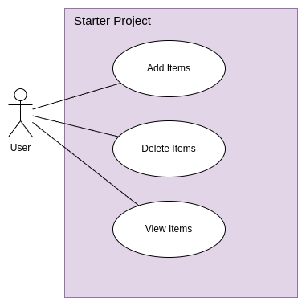
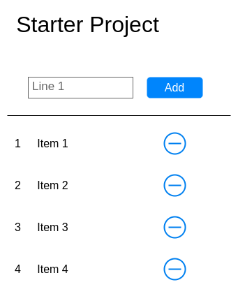
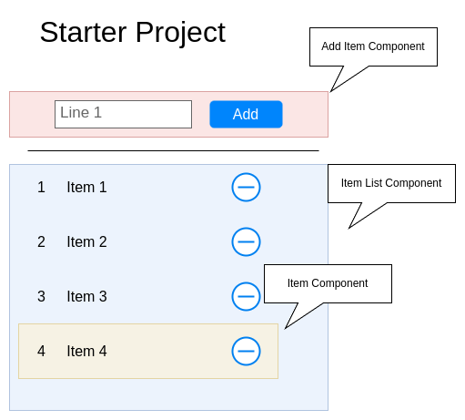
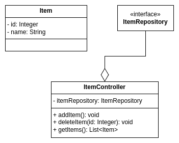

# Dokumentation - M450 Starterprojekt

## Use-Cases

Da die Applikation klein gehalten ist, gibt es nur wenige use-cases:

|    ID     | Use-Case     | User-Story                                                                                         |
| :-------: | :----------- | -------------------------------------------------------------------------------------------------- |
| **UC-01** | Add Items    | Als Benutzer möchte ich neue Items erfassen können, dass ich diese anschauen und löschen kann.     |
| **UC-02** | Delete Items | Als Benutzer möchte ich Items löschen können, damit diese nicht mehr in der Item-Liste auftauchen. |
| **UC-03** | View Items   | Als Benutzer möchte ich mir eine Liste mit den erfassten Items anzeigen können.                    |

## Screen Mockups

Basierend auf den Use-Cases wurde ein rudimentäres Screen-Mockup erstellt, welches in der Applikation weitestgehend gleich umgesetzt wurde.

## Komponenten

Anhand des Screen-Mockups wurden Komponenten identifiziert in welche die Applikation aufgeteilt werden kann.

|  Komponente   | Beschreibung                                                                                                                              |
| :-----------: | ----------------------------------------------------------------------------------------------------------------------------------------- |
| **Add Item**  | Die Komponente beinhaltet die HTML-Elemente und die Logik zum erfassen von neuen Items.                                                   |
| **Item List** | Diese Komponente ist für das beschaffen der Items zuständig und rendert dann die Liste.                                                   |
|   **Item**    | Die Item-Komponente stellt die Logik zum löschen eines einzelnen Eintrags der Item-List und beschreibt auch die Darstellung des Eintrags. |

## Klassendiagramm

Basierend auf der Beschreibung der Applikation wurde folgendes Klassendiagramm definiert. Da die Applikation sehr klein gehalten ist, werden nicht viele eigene Implementationen benötigt.

Da in der Applikation ein objektrelationaler Mapper eingesetzt wird, ist ein ERD für die darunterliegende Datenbank hinfällig. Die Datenbank und ihre Tabellen wird vom Spring-Framework generiert und verwaltet, womit dem Code-First Ansatz gefolgt wurde.

## Testfälle

Im Folgenden seien Testfälle zur Verifizierung der Funktionalität der App aufgelistet:

<!-- markdownlint-disable MD033-->

### TF-01: Item hinzufügen

|               |                                                                                                                                          |
| :------------ | :--------------------------------------------------------------------------------------------------------------------------------------- |
| Beschreibung  | Der Nutzer kann mittels UI neue Items erfassen                                                                                           |
| Vorbedingung  | Die Applikation startet und die Erfassungskomponente wird angezeigt                                                                      |
| Testschritte  | <ol><li>Die Applikation im Browser öffnen</li><li>Einen Eintrag ins Textfeld schreiben</li><li>Den hinzufügen Button anklicken</li></ol> |
| Nachbedingung | Das neu erfasste Element erscheint in der Item-Liste mit dem eingegebenen Text und einer ID                                              |

### TF-02: Item entfernen

|               |                                                                                                                             |
| :------------ | :-------------------------------------------------------------------------------------------------------------------------- |
| Beschreibung  | Der Nutzer kann mittels UI bestehende Items aus der Liste entfernen                                                         |
| Vorbedingung  | In der Item-Liste werden Items angezeigt sowie pro Item ein Löschen dargestellt                                             |
| Testschritte  | <ol><li>Die Applikation im Browser öffnen</li><li>Bei einem Eintrag der Item-Liste auf den Löschen-Button klicken</li></ol> |
| Nachbedingung | Das Item, bei welchem der Löschen-Button geklickt wurde, wird nicht mehr angezeigt                                          |

### TF-03: Items anzeigen

|               |                                                                                                                                                         |
| :------------ | :------------------------------------------------------------------------------------------------------------------------------------------------------ |
| Beschreibung  | Beim Aufrufen der Applikation wird dem Benutzer eine Liste mit gespeicherten Items angezeigt                                                            |
| Vorbedingung  | Es wurden bereits Items entweder via UI oder direkt in der Datenbank erfasst                                                                            |
| Testschritte  | <ol><li>Die Applikation im Browser öffnen</li></ol>                                                                                                     |
| Nachbedingung | <ul><li>Es erscheint eine Liste mit Item-Einträgen</li><li>Jeder Eintrag hat eine ID, einen Text sowie am Ende der Zeile einen Löschen-Button</li></ul> |

<!-- markdownlint-enable MD033-->
